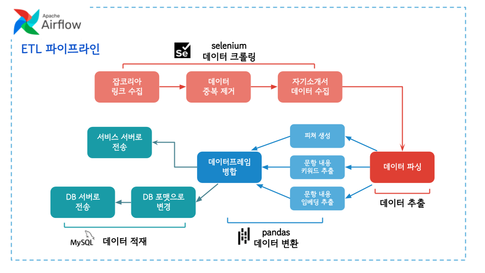

# RecommendU-etl

    

## Architecture

  
<b>Dags</b> Crawl-Extract-Transform-Load pipeline

## Overview
RecommendU의 핵심 데이터는 취업 포털 사이트의 합격 자기소개서를 사용합니다. 이러한 데이터는 지속적으로 업데이트되거나 삭제되기 때문에, RecommendU 서비스에서 이 변화를 반영하면 사용자들이 취업 시장의 동향, 신규 질문 항목 및 기업 요구사항에 더욱 빠르게 대응할 수 있습니다. 이를 위해, Apache Airflow를 사용하여 데이터 수집부터 데이터베이스 적재까지의 과정을 자동화하며, 배치 프로세스를 구축했습니다.

## ETL flow
- 데이터 크롤링
- raw data로부터 데이터 추출
- 추천시스템 결과 반영을 위한 데이터 처리
- 데이터베이스 적재